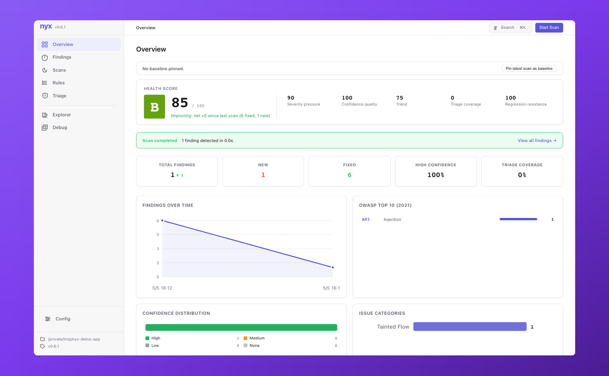
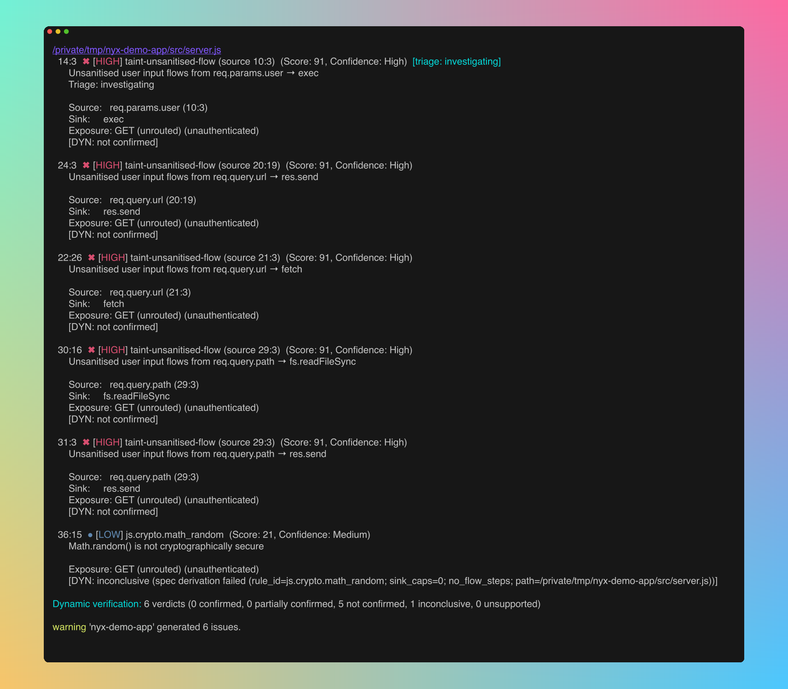

<div align="center">
  

**A local-first security scanner with a browser UI. Scan your repo and triage in your browser, with no cloud and no account.**

[](https://crates.io/crates/nyx-scanner)
[](https://www.gnu.org/licenses/gpl-3.0)
[](https://www.rust-lang.org)
[](https://github.com/elicpeter/nyx/actions)
[](https://elicpeter.github.io/nyx/)
</div>

<p align="center"></p>

---

## Scan locally, browse locally

Nyx runs a cross-language taint analysis on your repository, then serves the results to a React UI bound to `127.0.0.1`. You get a finding list with severity, evidence, and a step-by-step **flow visualiser** that walks the dataflow from source → sanitizer → sink. Triage decisions persist to `.nyx/triage.json`, which commits alongside your code so the team shares one triage state.

```bash
cargo install nyx-scanner
nyx scan           # runs the analyzer, caches findings in .nyx/
nyx serve          # opens http://localhost:9700 in your browser
```

Everything stays on your machine: loopback-only bind, host-header enforcement, CSRF on every mutation, no telemetry, no login.

<p align="center"></p>

---

## What's in the UI

| Page | What it shows |
|---|---|
| **Overview** | Dashboard: finding counts by severity, top offenders, engine profile summary |
| **Findings** | Browsable list with severity badges, triage status, rule filter, language filter |
| **Finding detail** | Flow-path visualiser with numbered steps (source → sanitizer → sink), code snippets, evidence, cross-file markers, triage dropdown |
| **Triage** | Bulk update states (open, investigating, fixed, false_positive, accepted_risk, suppressed), audit trail, import/export JSON |
| **Explorer** | File tree with per-file symbol list and finding overlay |
| **Scans** | Run history, metrics, diff two scans to see what changed |
| **Rules** | Built-in and custom rules per language; add rules from the UI |
| **Config** | Live config editor; reload without restart |


`nyx serve` flags: `--port <N>` (default `9700`), `--host <addr>` (loopback only: `127.0.0.1`, `localhost`, or `::1`), `--no-browser`. See `[server]` in `nyx.conf` for persistent settings, and the [Browser UI guide](https://elicpeter.github.io/nyx/serve.html) for the page-by-page UI tour and security model.

---

## CLI for CI

The same engine runs headless for CI pipelines. SARIF output uploads directly to GitHub Code Scanning.

<p align="center"></p>

```bash
# Fail the job on medium or higher, emit SARIF
nyx scan --format sarif --fail-on MEDIUM > results.sarif

# Ad-hoc JSON, no index
nyx scan ./server --format json --index off

# AST patterns only (fastest; skips CFG + taint)
nyx scan --mode ast

# Engine-depth shortcut: fast | balanced (default) | deep
# `deep` adds symex + demand-driven backwards taint for higher precision at ~2-3× cost
nyx scan --engine-profile deep
```

Forward cross-file taint runs in every profile. Symex and the demand-driven backwards walk are opt-in. Turn them on either via `--engine-profile deep`, or individually (`--symex`, `--backwards-analysis`). See the [CLI reference](https://elicpeter.github.io/nyx/cli.html#engine-depth-profile) for the full toggle matrix.

### GitHub Action

```yaml
- uses: elicpeter/nyx@v0.6.0
  with:
    format: sarif
    fail-on: MEDIUM
- uses: github/codeql-action/upload-sarif@v3
  with:
    sarif_file: nyx-results.sarif
```

Inputs: `path`, `version`, `format` (`sarif`|`json`|`console`), `fail-on`, `args`, `token`. Outputs: `finding-count`, `sarif-file`, `exit-code`, `nyx-version`. Linux and macOS runners (x86_64, ARM64).

---

## Install

**Cargo (recommended):**
```bash
cargo install nyx-scanner
```

**Pre-built binaries:** Grab the archive for your platform from [Releases](https://github.com/elicpeter/nyx/releases), verify against `SHA256SUMS` (and the detached `SHA256SUMS.asc` GPG signature, when present), unzip, and drop `nyx` on your `PATH`.

```bash
# Optional: verify the checksum file's GPG signature (when SHA256SUMS.asc is published)
gpg --verify SHA256SUMS.asc SHA256SUMS
sha256sum -c SHA256SUMS --ignore-missing
unzip nyx-x86_64-unknown-linux-gnu.zip && chmod +x nyx && sudo mv nyx /usr/local/bin/
```

**From source:**
```bash
git clone https://github.com/elicpeter/nyx.git
cd nyx && cargo build --release
```

Requires stable Rust 1.88+. The frontend is compiled and embedded in the binary at build time, so there is no separate install step for `nyx serve`.

---

## Languages

All 10 languages parse via tree-sitter and run through the full pipeline, but rule depth and engine coverage are uneven. Benchmark F1 on the 492-case corpus at [`tests/benchmark/ground_truth.json`](tests/benchmark/ground_truth.json) is 100% across all ten languages, so F1 alone no longer separates the tiers. Tiering reflects rule depth, gated-sink coverage, and structural idioms the synthetic corpus does not fully stress:

| Tier | Languages | F1 | Use as a CI gate? |
|---|---|---|---|
| **Stable** | Python, JavaScript, TypeScript | 100% | Yes |
| **Beta** | Java, PHP, Ruby, Rust, Go | 100% | Yes, with light FP triage |
| **Preview** | C, C++ | 100% on synthetic corpus | No. STL container flow, builder chains, and inline class member functions are tracked, but deep pointer aliasing and function pointers are not. Pair with clang-tidy or Clang Static Analyzer |

Aggregate rule-level F1: 100.0% (P=1.000, R=1.000). All real-CVE fixtures fire and the corpus carries zero open FPs. Per-dimension detail and known blind spots live on the [Language maturity page](https://elicpeter.github.io/nyx/language-maturity.html).

### Validated against real CVEs

The corpus also holds a small set of vulnerable/patched pairs extracted from published advisories, so the benchmark floor is defended by regression protection on demonstrably real bugs rather than just synthetic analogues. Nyx fires on the vulnerable file and emits zero findings on the patched file for each pair.

| CVE | Project | Language | Class |
|---|---|---|---|
| [CVE-2023-48022](https://nvd.nist.gov/vuln/detail/CVE-2023-48022) | Ray | Python | Command injection |
| [CVE-2017-18342](https://nvd.nist.gov/vuln/detail/CVE-2017-18342) | PyYAML | Python | Deserialization |
| [CVE-2019-14939](https://nvd.nist.gov/vuln/detail/CVE-2019-14939) | mongo-express | JavaScript | Code execution (`eval`) |
| [CVE-2025-64430](https://nvd.nist.gov/vuln/detail/CVE-2025-64430) | Parse Server | JavaScript | SSRF |
| [CVE-2023-26159](https://nvd.nist.gov/vuln/detail/CVE-2023-26159) | follow-redirects | TypeScript | SSRF |
| [CVE-2022-30323](https://nvd.nist.gov/vuln/detail/CVE-2022-30323) | hashicorp/go-getter | Go | Command injection |
| [CVE-2024-31450](https://nvd.nist.gov/vuln/detail/CVE-2024-31450) | owncast | Go | Path traversal |
| [CVE-2023-3188](https://nvd.nist.gov/vuln/detail/CVE-2023-3188) | owncast | Go | SSRF |
| [CVE-2015-7501](https://nvd.nist.gov/vuln/detail/CVE-2015-7501) | Apache Commons Collections | Java | Deserialization |
| [CVE-2017-12629](https://nvd.nist.gov/vuln/detail/CVE-2017-12629) | Apache Solr | Java | Command injection |
| [CVE-2013-0156](https://nvd.nist.gov/vuln/detail/CVE-2013-0156) | Ruby on Rails | Ruby | Deserialization |
| [CVE-2020-8130](https://nvd.nist.gov/vuln/detail/CVE-2020-8130) | Rake | Ruby | Command injection |
| [CVE-2017-9841](https://nvd.nist.gov/vuln/detail/CVE-2017-9841) | PHPUnit | PHP | Code execution (`eval`) |
| [CVE-2018-15133](https://nvd.nist.gov/vuln/detail/CVE-2018-15133) | Laravel | PHP | Deserialization |
| [CVE-2016-3714](https://nvd.nist.gov/vuln/detail/CVE-2016-3714) | ImageMagick (ImageTragick) | C | Command injection |
| [CVE-2019-18634](https://nvd.nist.gov/vuln/detail/CVE-2019-18634) | sudo (pwfeedback) | C | Memory safety |
| [CVE-2019-13132](https://nvd.nist.gov/vuln/detail/CVE-2019-13132) | ZeroMQ libzmq | C++ | Memory safety |
| [CVE-2022-1941](https://nvd.nist.gov/vuln/detail/CVE-2022-1941) | Protocol Buffers | C++ | Memory safety |

Fixtures live under [`tests/benchmark/cve_corpus/`](tests/benchmark/cve_corpus/) with upstream attribution headers.

<!--
### Real-world findings

- **Nextcloud server**, [PR #59979](https://github.com/nextcloud/server/pull/59979), merged. The runtime decoder for this column already restricted `allowed_classes`, but the repair routine called `unserialize()` without it, so magic methods on referenced classes could still run. Fix matches the runtime path.
-->

---

## How it works

Two passes over the filesystem, with an optional SQLite index to skip unchanged files:

1. **Pass 1**: parse each file via tree-sitter, build an intra-procedural CFG (petgraph), lower to pruned SSA (Cytron phi insertion over dominance frontiers), and export per-function summaries (source/sanitizer/sink caps, taint transforms, points-to, callees).
2. **Summary merge**: union all per-file summaries into a `GlobalSummaries` map.
3. **Pass 2**: re-analyze each file with cross-file context under bounded context sensitivity (k=1 inlining for intra-file callees, SCC fixpoint capped at 64 iterations, and summary fallback for callees above the inline body-size cap). A forward dataflow worklist propagates taint through the SSA lattice with guaranteed convergence. Call-graph SCCs iterate to fixed-point (within the cap) so mutually recursive functions get accurate summaries.
4. **Rank, dedupe, emit**: findings are scored by severity × evidence strength × source-kind exploitability, then emitted to console, JSON, or SARIF.

Detector families: taint (cross-file source→sink), CFG structural (auth gaps, unguarded sinks, resource leaks), state model (use-after-close, double-close, must-leak, unauthed-access), AST patterns (tree-sitter structural match). Full detector docs: [Detectors](https://elicpeter.github.io/nyx/detectors.html).

---

## Configuration

Config merges `nyx.conf` (defaults) and `nyx.local` (your overrides) from the platform config directory (`~/.config/nyx/` on Linux, `~/Library/Application Support/nyx/` on macOS, `%APPDATA%\elicpeter\nyx\config\` on Windows).

```toml
[scanner]
mode         = "full"        # full | ast | cfg | taint
min_severity = "Medium"

[server]
host = "127.0.0.1"
port = 9700
open_browser = true

# Project-specific sanitizer
[[analysis.languages.javascript.rules]]
matchers = ["escapeHtml"]
kind     = "sanitizer"
cap      = "html_escape"
```

Or add rules interactively: `nyx config add-rule --lang javascript --matcher escapeHtml --kind sanitizer --cap html_escape`. Caps: `env_var`, `html_escape`, `shell_escape`, `url_encode`, `json_parse`, `file_io`, `fmt_string`, `sql_query`, `deserialize`, `ssrf`, `data_exfil`, `code_exec`, `crypto`, `unauthorized_id`, `all`. Full schema: [Configuration](https://elicpeter.github.io/nyx/configuration.html).

---

## Status

Under active development. APIs, detector behavior, and configuration options may change between releases. Rule-level F1 on the 492-case corpus is the CI regression floor; per-language detail lives in [`tests/benchmark/RESULTS.md`](tests/benchmark/RESULTS.md).

Taint analysis is interprocedural. Persisted per-function SSA summaries carry per-return-path transforms and parameter-granularity points-to, and call-graph SCCs (including SCCs that span files) iterate to a joint fixed-point. The default `balanced` profile also runs k=1 context-sensitive inlining for intra-file callees. Symex (with cross-file and interprocedural frames) and the demand-driven backwards walk are opt-in. Enable them individually with `--symex` and `--backwards-analysis`, or together with `--engine-profile deep`.

Limitations:
- Interprocedural precision is bounded rather than unlimited. Context-sensitive inlining is k=1 with a callee body-size cap, and SCC fixed-point has an iteration cap. When the engine hits a bound it falls back to summaries and records an `engine_note` on the finding.
- Cross-language calls (FFI, subprocess, WASM) are not traversed. Each language is analysed independently.
- Several language features are not modeled: macros, most dynamic dispatch, aliased imports, reflection.
- C/C++ are preview tier. STL container flow, builder chains, and inline class member functions are tracked now; deep pointer aliasing and function pointers are not. A clean report should not be read as a clean audit. Pair with a clang-based tool before using as a hard CI gate.
- Results may contain false positives or false negatives; manual review is expected.

---

## Documentation

Browse the full docs site at **[elicpeter.github.io/nyx](https://elicpeter.github.io/nyx/)**.

- [Quick Start](https://elicpeter.github.io/nyx/quickstart.html) · [CLI Reference](https://elicpeter.github.io/nyx/cli.html) · [Installation](https://elicpeter.github.io/nyx/installation.html)
- [`nyx serve`](https://elicpeter.github.io/nyx/serve.html) · [Output Formats](https://elicpeter.github.io/nyx/output.html) · [Configuration](https://elicpeter.github.io/nyx/configuration.html)
- [How it works](https://elicpeter.github.io/nyx/how-it-works.html) · [Detectors](https://elicpeter.github.io/nyx/detectors.html) ([Taint](https://elicpeter.github.io/nyx/detectors/taint.html), [CFG](https://elicpeter.github.io/nyx/detectors/cfg.html), [State](https://elicpeter.github.io/nyx/detectors/state.html), [AST Patterns](https://elicpeter.github.io/nyx/detectors/patterns.html))
- [Rule Reference](https://elicpeter.github.io/nyx/rules.html) · [Language Maturity](https://elicpeter.github.io/nyx/language-maturity.html) · [Advanced Analysis](https://elicpeter.github.io/nyx/advanced-analysis.html) · [Auth Analysis](https://elicpeter.github.io/nyx/auth.html)

---

## Contributing

Contributions are welcome.

Nyx is open source and will always have a fully open-source core. To support long-term development and keep the project sustainable, contributors may be asked to sign a Contributor License Agreement before their first merged contribution.

Run `sh scripts/check.sh` before submitting. See [`CONTRIBUTING.md`](CONTRIBUTING.md) for the full guide, including how to add rules and support new languages. Open an issue for crashes, panics, or suspicious results; attach a minimal snippet and the Nyx version.

---

## AI Disclosure

- **Engine code** (taint, SSA, CFG, call graph, abstract interp, symbolic exec): predominantly human-written. AI was used selectively for refactors and boilerplate, with all merges human-reviewed.
- **Docs and most of this README**: AI-generated from the code and hand-edited. Report doc/code drift as a bug.
- **Test fixtures and `expected.yaml` files**: AI-assisted drafting, human-audited before landing.
- **Frontend UI** (React app): built with AI assistance, human-reviewed.

As with any static analyzer, validate findings against your own corpus before using Nyx as a CI gate.

---

## License

GNU General Public License v3.0 or later (GPL-3.0-or-later). The optional `smt` feature bundles Z3 (MIT-licensed); distributors of binaries built with `--features smt` should include Z3's license in their attribution. Full text in [LICENSE](./LICENSE); third-party dependencies in [THIRDPARTY-LICENSES.html](./THIRDPARTY-LICENSES.html).
