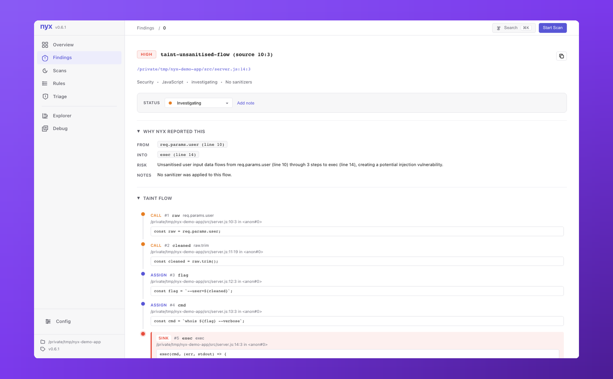

# Auth analysis

**Rust today.** Other languages have rule scaffolding in [`src/auth_analysis/config.rs`](https://github.com/elicpeter/nyx/blob/master/src/auth_analysis/config.rs) (Python, Ruby, Go, Java, JavaScript, TypeScript), but only Rust has benchmark corpus coverage and the precision work to back it. Treat findings on other languages as preview; the rule prefix (`py.auth.*`, `js.auth.*`, `rb.auth.*`, `go.auth.*`, `java.auth.*`) is reserved but the matchers haven't been validated against real codebases yet.

## What it catches

The Rust rule is `rs.auth.missing_ownership_check`. It fires when a request handler reaches a privileged operation that takes a scoped identifier (`*_id`, row reference, scoped resource) without a preceding ownership or membership check.

Concretely, it looks for five patterns of authorization in the function body and flags the call when none are present:

- A call to a recognised authorization helper. Defaults: `check_ownership`, `has_ownership`, `require_ownership`, `ensure_ownership`, `is_owner`, `authorize`, `verify_access`, `has_permission`, `can_access`, `can_manage`, plus `*_membership` and `require_{group,org,workspace,tenant,team}_member` variants. Extend in `[analysis.languages.rust]`.
- An ownership-equality check on a row reference: `if owner_id != user.id { return 403 }` or any `field_id != self_actor` shape. The check writes `AuthCheck` evidence back to the row-fetch arguments via `AnalysisUnit.row_field_vars`.
- A self-actor reference: `let user = require_auth(...).await?` followed by use of `user.id`, `user.user_id`, `user.uid`. The actor is recognised from typed extractor params (`Extension<Session>`, `CurrentUser`, etc.) and from typed helper bindings.
- A SQL query that joins through an ACL table or filters by `user_id` predicate. Detected without a SQL parser via [`sql_semantics.rs`](https://github.com/elicpeter/nyx/blob/master/src/auth_analysis/sql_semantics.rs); the authorized result variable propagates through `let row = ...prepare(LIT)...`, `for row in result`, `let id = row.get(...)`.
- A helper-summary lift: handler calls `validate_target(db, widget_id, user.id)` whose body contains a `require_*_member` call. Cross-function summaries are merged at fixed-point (capped at 4 iterations).

## Sink classification

The same call name can be safe on a local collection and dangerous on a database. The detector categorises each candidate sink before deciding whether to flag:

| Class | Examples | Default treatment |
|---|---|---|
| `InMemoryLocal` | `map.insert`, `set.insert`, `vec.push` on tracked local | Never a sink |
| `RealtimePublish` | `realtime.publish_to_group`, `pubsub.send` | Sink unless ownership is established for the channel scope |
| `OutboundNetwork` | `http.post`, `reqwest::Client::post` | Sink unless a sanitiser is on the path |
| `CacheCrossTenant` | `redis.set`, `memcached.set` with scoped keys | Sink unless tenant is checked |
| `DbMutation` | `db.insert`, `repo.save` with scoped IDs | Sink unless ownership is established |
| `DbCrossTenantRead` | `db.query` returning rows from a tenant scope | Sink unless ACL-join or tenant predicate is present |

Receiver type drives the classification when SSA type facts are available, so `client.send(...)` correctly resolves through the receiver's inferred type.

## What it can't catch

- **Non-Rust frameworks**, in practice. Scaffolding exists; coverage doesn't.
- **Type-system authorization.** A typestate pattern that makes unauthenticated handlers fail to compile (`fn endpoint(user: AuthenticatedUser<Admin>)`) is invisible. This is mostly fine because the type system already enforced the check, but the rule won't credit it.
- **Authorization performed only via macros** that the AST doesn't expose as a recognisable call.
- **Cross-async-boundary actor binding.** If the handler awaits `let user = require_auth(...).await?` and then spawns a task that uses `user.id` after a `tokio::spawn`, the spawn body is treated as a separate scope.

## The taint-based variant

A second rule, `rs.auth.missing_ownership_check.taint`, folds the same logic into the SSA/taint engine using the `Cap::UNAUTHORIZED_ID` capability (bit 12). Request-bound handler parameters seed `UNAUTHORIZED_ID` into taint state; ownership checks act as sanitizers that strip the cap; sinks that take scoped IDs require it absent.

This path is **off by default** while the standalone analyser carries the stable signal. Enable both:

```toml
[scanner]
enable_auth_as_taint = true
```

Run them together; if both fire for the same site, treat it as the same finding (the taint variant carries fuller flow evidence).

## Tuning

### Add a project-specific authorization helper

```toml
[[analysis.languages.rust.rules]]
matchers = ["require_subscription", "ensure_paid_seat"]
kind     = "sanitizer"
cap      = "unauthorized_id"
```

The same rule recognised in the standalone analyser also strips `Cap::UNAUTHORIZED_ID` for the taint-based variant.

### Recognised actor names

Recognised by default: `user.id`, `user.user_id`, `user.uid`, `session.user_id`, `current_user.id`, plus typed extractor parameters with `CurrentUser`, `SessionUser`, `AuthUser`, `Extension<...>` shapes. To add a custom binding pattern, file an issue or add a fixture; the heuristic is in [`src/auth_analysis/checks.rs`](https://github.com/elicpeter/nyx/blob/master/src/auth_analysis/checks.rs) under `extract_validation_target` and friends.

### Suppress

Inline:

```rust
db.insert(widget_id, value)?;  // nyx:ignore rs.auth.missing_ownership_check
```

Or filter by severity / confidence in CI:

```bash
nyx scan . --severity ">=MEDIUM" --min-confidence medium
```

## In the UI

Auth findings render alongside taint findings in the [browser UI](serve.md). The flow visualiser shows the sink call, the actor reference (when one was found), and any helper-summary path the engine traversed; the How to fix panel mirrors the rule's recommendation.

<p align="center"></p>

## Benchmark corpus

The Rust auth corpus at [`tests/benchmark/corpus/rust/auth/`](https://github.com/elicpeter/nyx/tree/master/tests/benchmark/corpus/rust/auth/) is 10 fixtures covering the five FP patterns plus a true-positive control. Per-row metrics live under the Rust auth row in `tests/benchmark/RESULTS.md`.
