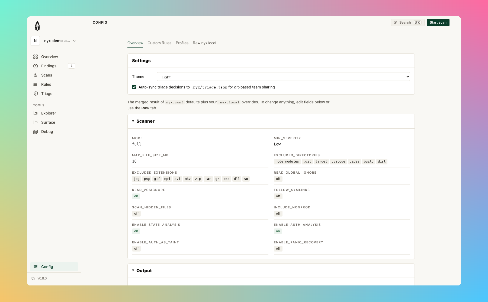

# Configuration

Nyx uses TOML configuration files. A default config is auto-generated on first run. If you'd rather edit settings and rules from the browser, the [Config page in `nyx serve`](serve.md#config) is a live editor that writes back to `nyx.local`:

<p align="center"></p>

## File Locations

| Platform | Directory |
|----------|-----------|
| Linux | `~/.config/nyx/` |
| macOS | `~/Library/Application Support/nyx/` |
| Windows | `%APPDATA%\elicpeter\nyx\config\` |

Run `nyx config path` to see the exact directory on your system.

## File Precedence

1. **`nyx.conf`** -- Default config (auto-created from built-in template on first run)
2. **`nyx.local`** -- User overrides (loaded on top of defaults)

Both files are optional. CLI flags take precedence over both.

## Merge Strategy

| Type | Behavior |
|------|----------|
| Scalars (`mode`, `min_severity`, booleans) | User value wins |
| Arrays (`excluded_extensions`, `excluded_directories`, `excluded_files`) | Union + deduplicate |
| Analysis rules | Per-language union with deduplication |
| Profiles | User profile with same name fully replaces built-in |
| Server / Runs | User value wins (full section override) |

Example:
```toml
# nyx.conf (default):
excluded_extensions = ["jpg", "png", "exe"]

# nyx.local (user):
excluded_extensions = ["foo", "jpg"]

# Effective result:
# ["exe", "foo", "jpg", "png"]  -- sorted, deduped union
```

---

## Full Schema

### `[scanner]`

| Field | Type | Default | Description |
|-------|------|---------|-------------|
| `mode` | `"full"` \| `"ast"` \| `"cfg"` \| `"taint"` | `"full"` | Analysis mode |
| `min_severity` | `"Low"` \| `"Medium"` \| `"High"` | `"Low"` | Minimum severity to report |
| `max_file_size_mb` | int \| null | 16 | Max file size in MiB; null = unlimited. Default is a safe ceiling for untrusted repos; lift explicitly when scanning trusted codebases with large generated files |
| `excluded_extensions` | [string] | `["jpg", "png", "gif", "mp4", ...]` | File extensions to skip |
| `excluded_directories` | [string] | `["node_modules", ".git", "target", ...]` | Directories to skip |
| `excluded_files` | [string] | `[]` | Specific files to skip |
| `read_global_ignore` | bool | `false` | Honor global ignore file (RESERVED) |
| `read_vcsignore` | bool | `true` | Honor `.gitignore` / `.hgignore` |
| `require_git_to_read_vcsignore` | bool | `true` | Require `.git` dir to apply gitignore |
| `one_file_system` | bool | `false` | Don't cross filesystem boundaries |
| `follow_symlinks` | bool | `false` | Follow symbolic links |
| `scan_hidden_files` | bool | `false` | Scan dot-files |
| `include_nonprod` | bool | `false` | Keep original severity for test/vendor paths |
| `enable_state_analysis` | bool | `true` | Enable resource lifecycle + auth state analysis. Detects use-after-close, double-close, resource leaks (per-function scope), and unauthenticated access. Requires `mode = "full"` or `mode = "taint"`. |

### `[database]`

| Field | Type | Default | Description |
|-------|------|---------|-------------|
| `path` | string | `""` | Custom SQLite DB path; empty = platform default (RESERVED) |
| `auto_cleanup_days` | int | `30` | Days to keep DB files (RESERVED) |
| `max_db_size_mb` | int | `1024` | Maximum DB size in MiB (RESERVED) |
| `vacuum_on_startup` | bool | `false` | Run VACUUM before indexed scans |

### `[output]`

| Field | Type | Default | Description |
|-------|------|---------|-------------|
| `default_format` | `"console"` \| `"json"` \| `"sarif"` | `"console"` | Default output format (used when `--format` is not specified) |
| `quiet` | bool | `false` | Suppress status messages |
| `max_results` | int \| null | null | Cap number of findings; null = unlimited |
| `attack_surface_ranking` | bool | `true` | Enable attack-surface ranking |
| `min_score` | int \| null | null | Minimum rank score to include; null = no minimum |
| `min_confidence` | string \| null | null | Minimum confidence level (`"low"`, `"medium"`, `"high"`); null = no minimum |
| `include_quality` | bool | `false` | Include Quality-category findings (hidden by default) |
| `show_all` | bool | `false` | Disable category filtering, rollups, and LOW budgets |
| `max_low` | int | `20` | Maximum total LOW findings to show (rollups count as 1) |
| `max_low_per_file` | int | `1` | Maximum LOW findings per file (rollups count as 1) |
| `max_low_per_rule` | int | `10` | Maximum LOW findings per rule (rollups count as 1) |
| `rollup_examples` | int | `5` | Number of example locations stored in rollup findings |

### `[performance]`

| Field | Type | Default | Description |
|-------|------|---------|-------------|
| `max_depth` | int \| null | null | Max filesystem traversal depth; null = unlimited |
| `min_depth` | int \| null | null | Min depth for reported entries (RESERVED) |
| `prune` | bool | `false` | Stop traversing into matching directories (RESERVED) |
| `worker_threads` | int \| null | null | Worker thread count; null/0 = auto-detect |
| `batch_size` | int | `100` | Files per index batch |
| `channel_multiplier` | int | `4` | Channel capacity = threads x multiplier |
| `rayon_thread_stack_size` | int | `8388608` | Rayon thread stack size in bytes (8 MiB) |
| `scan_timeout_secs` | int \| null | null | Per-file timeout in seconds (RESERVED) |
| `memory_limit_mb` | int | `512` | Max memory in MiB (RESERVED) |

### `[server]`

Configuration for the local web UI (`nyx serve`).

| Field | Type | Default | Description |
|-------|------|---------|-------------|
| `enabled` | bool | `true` | Whether the serve command is enabled |
| `host` | string | `"127.0.0.1"` | Host to bind to (localhost by default) |
| `port` | int | `9700` | Port for the web UI |
| `open_browser` | bool | `true` | Open browser automatically on serve |
| `auto_reload` | bool | `true` | Auto-reload UI when scan results change |
| `persist_runs` | bool | `true` | Persist scan runs for history view |
| `max_saved_runs` | int | `50` | Maximum number of saved runs |

### `[runs]`

Configuration for scan run persistence and history.

| Field | Type | Default | Description |
|-------|------|---------|-------------|
| `persist` | bool | `false` | Persist scan run history to disk |
| `max_runs` | int | `100` | Maximum number of runs to keep |
| `save_logs` | bool | `false` | Save scan logs with each run |
| `save_stdout` | bool | `false` | Save stdout capture with each run |
| `save_code_snippets` | bool | `true` | Save code snippets in findings |

### `[profiles.<name>]`

Named scan presets that override scan-related config. Activate with `--profile <name>`.

All fields are optional; omitted fields inherit from the base config.

| Field | Type | Description |
|-------|------|-------------|
| `mode` | string | Analysis mode |
| `min_severity` | string | Minimum severity |
| `max_file_size_mb` | int | Max file size in MiB |
| `include_nonprod` | bool | Keep original severity for test/vendor |
| `enable_state_analysis` | bool | Enable state analysis |
| `default_format` | string | Output format |
| `quiet` | bool | Suppress status output |
| `attack_surface_ranking` | bool | Enable ranking |
| `max_results` | int | Max findings |
| `min_score` | int | Min rank score |
| `show_all` | bool | Show all findings |
| `include_quality` | bool | Include quality findings |
| `worker_threads` | int | Worker thread count |
| `max_depth` | int | Max traversal depth |

**Built-in profiles:**

| Name | Description |
|------|-------------|
| `quick` | AST-only, medium+ severity |
| `full` | Full analysis with state analysis enabled |
| `ci` | Full analysis, medium+ severity, quiet, SARIF output |
| `taint_only` | Taint analysis only |
| `conservative_large_repo` | AST-only, high severity, 5 MiB file limit, depth 10 |

User-defined profiles with the same name as a built-in will override it.

### `[analysis.engine]`

Release-grade switches for the optional analysis passes.  Each toggle has a
matching CLI flag (pair of `--foo` / `--no-foo`) that overrides the config
value for a single run.  These used to be `NYX_*` environment variables
(`NYX_CONSTRAINT`, `NYX_ABSTRACT_INTERP`, `NYX_SYMEX`, `NYX_CROSS_FILE_SYMEX`,
`NYX_SYMEX_INTERPROC`, `NYX_CONTEXT_SENSITIVE`, `NYX_PARSE_TIMEOUT_MS`,
`NYX_SMT`); those env vars are still honored as a last-resort override when
nyx is used as a library (no CLI entry point), but the config/CLI surface is
the stable path.

| Field | Type | Default | Description |
|-------|------|---------|-------------|
| `constraint_solving` | bool | `true` | Path-constraint solving (prunes infeasible paths in taint) |
| `abstract_interpretation` | bool | `true` | Interval / string / bit abstract domains carried through the SSA worklist |
| `context_sensitive` | bool | `true` | k=1 context-sensitive callee inlining for intra-file calls |
| `backwards_analysis` | bool | `false` | Demand-driven backwards taint walk from sinks (adds scan time; default off) |
| `parse_timeout_ms` | int | `10000` | Per-file tree-sitter parse timeout; `0` disables the cap |

**`[analysis.engine.symex]`** sub-section:

| Field | Type | Default | Description |
|-------|------|---------|-------------|
| `enabled` | bool | `true` | Run the symex pipeline after taint; adds witness strings and symbolic verdicts |
| `cross_file` | bool | `true` | Persist / consult cross-file SSA bodies so symex can reason about callees defined in other files |
| `interprocedural` | bool | `true` | Intra-file interprocedural symex (k ≥ 2 via frame stack) |
| `smt` | bool | `true` | Use the SMT backend when nyx is built with the `smt` feature; ignored otherwise |

CLI flag map (each pair is `--enable / --no-enable`):

| Config field | CLI flags |
|---|---|
| `constraint_solving` | `--constraint-solving` / `--no-constraint-solving` |
| `abstract_interpretation` | `--abstract-interp` / `--no-abstract-interp` |
| `context_sensitive` | `--context-sensitive` / `--no-context-sensitive` |
| `backwards_analysis` | `--backwards-analysis` / `--no-backwards-analysis` |
| `parse_timeout_ms` | `--parse-timeout-ms <N>` |
| `symex.enabled` | `--symex` / `--no-symex` |
| `symex.cross_file` | `--cross-file-symex` / `--no-cross-file-symex` |
| `symex.interprocedural` | `--symex-interproc` / `--no-symex-interproc` |
| `symex.smt` | `--smt` / `--no-smt` |

**Engine-depth profile shortcut**: instead of flipping individual toggles, pass `--engine-profile {fast,balanced,deep}` to set the whole stack at once.  Individual flags override the profile, so `--engine-profile fast --backwards-analysis` runs the fast stack with backwards analysis on.  See `docs/cli.md` for the exact toggle matrix.

**Explain effective engine**: pass `--explain-engine` to print the resolved engine configuration (profile + config + CLI overrides) and exit without scanning.

### `[detectors.data_exfil]`

Per-project tuning for the `taint-data-exfiltration` rule. All fields are optional.

| Field | Type | Default | Description |
|-------|------|---------|-------------|
| `enabled` | bool | `true` | Set `false` to strip `Cap::DATA_EXFIL` from sink caps before emission. No `taint-data-exfiltration` finding reaches the report. Other taint classes are not affected. |
| `trusted_destinations` | [string] | `[]` | URL prefixes that drop `Cap::DATA_EXFIL` on the call site. Matched against the abstract-string domain prefix of the destination arg, so a literal URL or a template literal with a static prefix both work. Use full origins or origin-pinned paths and include the trailing `/`, otherwise `https://api.` matches `https://api.evil.example.com/` too. |

```toml
[detectors.data_exfil]
enabled = true
trusted_destinations = [
  "https://api.internal/",
  "https://telemetry.example.com/",
]
```

For the sanitizer convention, source sensitivity gate, and per-language sink coverage, see [Detectors / Taint / DATA_EXFIL](detectors/taint.md#data_exfil-suppression-layers).

### `[analysis.languages.<slug>]`

Per-language custom rules. `<slug>` is one of: `rust`, `javascript`, `typescript`, `python`, `go`, `java`, `c`, `cpp`, `php`, `ruby`.

| Field | Type | Description |
|-------|------|-------------|
| `rules` | array of rule objects | Custom label rules |
| `terminators` | [string] | Functions that terminate execution |
| `event_handlers` | [string] | Event handler function names |

**Rule object**:

```toml
[[analysis.languages.javascript.rules]]
matchers = ["escapeHtml"]
kind = "sanitizer"        # "source" | "sanitizer" | "sink"
cap = "html_escape"       # "env_var" | "html_escape" | "shell_escape" |
                          # "url_encode" | "json_parse" | "file_io" |
                          # "fmt_string" | "sql_query" | "deserialize" |
                          # "ssrf" | "data_exfil" | "code_exec" | "crypto" |
                          # "unauthorized_id" | "all"
```

---

## Example Configurations

### Minimal override (`nyx.local`)

```toml
[scanner]
min_severity = "Medium"

[output]
default_format = "json"
max_results = 100
```

### CI-optimized

```toml
[scanner]
mode = "full"
min_severity = "Medium"
excluded_directories = ["node_modules", ".git", "target", "vendor", "dist"]

[output]
quiet = true
default_format = "sarif"

[performance]
worker_threads = 4
```

### Using a scan profile

```bash
# Use a built-in profile
nyx scan --profile ci

# CLI flags still override profile values
nyx scan --profile ci --format json
```

### Custom profile

```toml
[profiles.security_audit]
mode = "full"
min_severity = "Low"
enable_state_analysis = true
show_all = true
```

### Custom rules for a Node.js project

```toml
[analysis.languages.javascript]
terminators = ["process.exit", "abort"]
event_handlers = ["addEventListener"]

[[analysis.languages.javascript.rules]]
matchers = ["escapeHtml", "sanitizeInput"]
kind = "sanitizer"
cap = "html_escape"

[[analysis.languages.javascript.rules]]
matchers = ["dangerouslySetInnerHTML"]
kind = "sink"
cap = "html_escape"

[[analysis.languages.javascript.rules]]
matchers = ["getRequestBody", "readUserInput"]
kind = "source"
cap = "all"
```

### Adding rules via CLI

```bash
# Add a sanitizer
nyx config add-rule --lang javascript --matcher escapeHtml --kind sanitizer --cap html_escape

# Add a terminator
nyx config add-terminator --lang javascript --name process.exit

# Verify
nyx config show
```

---

## Config Validation

Config is validated after loading and merging. Validation checks include:

- Server port must be 1–65535
- Server host must not be empty
- `max_saved_runs` must be > 0 when `persist_runs` is true
- `max_runs` must be > 0 when `persist` is true
- `batch_size` and `channel_multiplier` must be > 0
- `rollup_examples` must be > 0
- Profile names must be alphanumeric with underscores only

Invalid config produces structured error messages identifying the section, field, and issue.

---

## State Analysis

State analysis detects resource lifecycle violations (use-after-close, double-close, resource leaks) and unauthenticated access patterns. It is **enabled by default**.

To disable:

```toml
[scanner]
enable_state_analysis = false
```

State analysis requires `mode = "full"` or `mode = "taint"`. It has no effect in `mode = "ast"`.

**Tradeoffs**:
- Additional per-function state-machine pass adds some scan time
- May produce findings that require domain knowledge to evaluate (e.g., whether a resource handle is intentionally left open)
- Most useful for C, C++, Rust, Go, and Java where acquire/release patterns are common

---

## Upgrading

### Engine-version mismatch is handled automatically

Nyx stores the scanner's `CARGO_PKG_VERSION` in the project index database.
When the version recorded in the DB differs from the running binary; or the
row is missing entirely; every cached summary, SSA body, and file-hash row
is wiped on the next open so the next scan rebuilds the index against the new
engine. No flag is needed; CI pipelines keep working across upgrades.

The rebuild is logged at `info` level:

```
engine version changed (0.4.0 → 0.5.0), rebuilding index
```

If you see this once per upgrade it is working as intended. If you see it on
every scan, the metadata row is not being persisted; file an issue.

### Forcing a reindex

Use `--index rebuild` to throw away the current project's cached summaries
and re-run pass 1 against the current rules. Useful after editing
`nyx.local` rules, after an upgrade that changed label definitions without
changing the engine version, or when you want a known-clean baseline:

```bash
nyx scan --index rebuild .
```

This clears the current project's rows in `files`, `function_summaries`,
`ssa_function_summaries`, and `ssa_function_bodies`; other projects sharing
the same DB directory are untouched.

### Recovering from a corrupt database

If the `.sqlite` file itself is damaged (e.g. from a killed scan or full
disk) and `nyx scan` fails to open it, delete the file and let the next
scan recreate it:

```bash
rm "$(nyx config path)"/<project>.sqlite*
```

On the next scan Nyx builds a fresh index from scratch.

---

## Reserved Fields

Some config fields are defined but not yet implemented. They are marked `(RESERVED)` in the default config and accept values without effect. This allows forward-compatible config files; settings will activate when the feature is implemented without requiring config changes.
