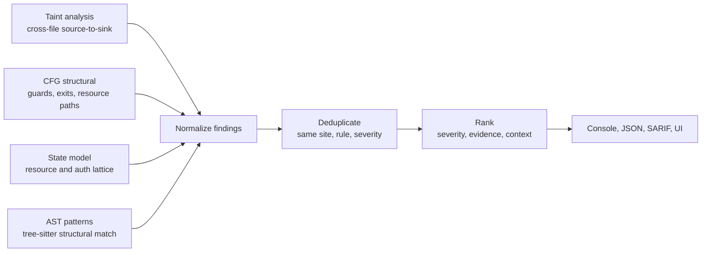

# Detectors

Nyx ships four independent detector families. They run together in `--mode full`, the default. Findings are merged, deduplicated, ranked, and printed in one result set.

| Family | Rule prefix | Looks at | What it finds |
|---|---|---|---|
| [Taint analysis](detectors/taint.md) | `taint-*` | Cross-file dataflow | Unsanitized data flowing source to sink |
| [CFG structural](detectors/cfg.md) | `cfg-*` | Per-function control flow | Auth gaps, unguarded sinks, error fallthrough, resource release on all paths |
| [State model](detectors/state.md) | `state-*` | Per-function state lattice | Use-after-close, double-close, leaks, unauthenticated access |
| [AST patterns](detectors/patterns.md) | `<lang>.<cat>.<name>` | Tree-sitter structural match | Banned APIs, weak crypto, dangerous constructs |



The taint family is split into cap-specific rule classes when a sink callee carries multiple vulnerability classes:

| Rule id | Cap | Surface |
|---|---|---|
| `taint-unsanitised-flow` | `sql_query`, `ssrf`, `code_exec`, `file_io`, `fmt_string`, `deserialize`, `crypto` | Catch-all class for the legacy caps that have not migrated to a dedicated rule id yet. |
| `taint-ldap-injection` | `ldap_injection` | Attacker-controlled data concatenated into an LDAP filter or DN without RFC 4515 escaping. Receivers typed as `LdapClient` (JNDI `DirContext`, Spring `LdapTemplate`, ldapjs `Client`, python-ldap `LDAPObject`, ldap3 `Connection`) and chained `.search` / `.searchByEntity` / `.search_s` form the sink set. |
| `taint-xpath-injection` | `xpath_injection` | Attacker-controlled string passed as the XPath expression to `xpath.evaluate` / `xpath.compile` / `document.evaluate` / `DOMXPath::query` / `etree.XPath`. Suppressed when the receiver was bound to an `XPathVariableResolver` (parameterised XPath shape). |
| `taint-header-injection` | `header_injection` | Attacker-controlled bytes landing in an HTTP response header without `\r\n` stripping (response splitting, cache poisoning). Covers `setHeader` / `res.set` / `res.append` / `headers["X-Foo"] = bar` / `Header().Set` / `add_header` / `setcookie` / `http.Header.Set`. |
| `taint-open-redirect` | `open_redirect` | Attacker-controlled URL driving a redirect / `Location` header without an allowlist or relative-URL check. Includes the Spring MVC `return "redirect:" + url` view-name shape via the `__spring_redirect__` synthetic sink. Suppressed by `RelativeUrlValidated` (`startsWith("/")` family) and `HostAllowlistValidated` (`new URL(x).host === ALLOWED`, `urlparse(x).netloc == ...`) inline predicates. |
| `taint-template-injection` | `ssti` | Attacker controls the *template source string* fed to a server-side renderer (Jinja2 / Mako / FreeMarker / Twig / Handlebars / EJS / Mustache / ERB / `text/template` / `html/template` / Smarty / Blade `Template(...)` / `compile(...)`), distinct from rendering a trusted template with tainted variables. |
| `taint-xxe` | `xxe` | Attacker-controlled XML reaching a parser that resolves external entities. Covers JAXP `DocumentBuilder.parse` / `SAXParser.parse` / `XMLReader.parse`, lxml `etree.parse`, Nokogiri, fast-xml-parser, xml2js, libxml2 `xmlReadFile` / `xmlReadMemory`. Suppressed when the receiver carries a hardening fact in `xml_parser_config` (`secure_processing`, `disallow_doctype`, `processEntities: false`, `LIBXML_NOENT` not set). |
| `taint-prototype-pollution` | `prototype_pollution` | Attacker-controlled key reaching an object property assignment that can mutate `Object.prototype`. JS/TS only. Covers `obj[tainted] = v` (synthetic `__index_set__` sink), library-mediated deep-merge / set helpers (`_.merge`, `_.set`, `dotProp.set`, `objectPath.set`, `setValue`), and jQuery's `extend(true, target, src)` deep-merge form via the `LiteralOnly` activation gate. Suppressed by constant-key fold (`__proto__` / `constructor` / `prototype` filtering), reject / allowlist guards on the key, and `Object.create(null)` receivers (flow-sensitive `NullPrototypeObject` type). Python equivalent (`dict.update`) is opt-in via `NYX_PYTHON_PROTO_POLLUTION=1`. |
| `taint-data-exfiltration` | `data_exfil` | Sensitive data flowing into the payload of an outbound network request (body / headers / json on `fetch`, body on `XMLHttpRequest.send`). Distinct from SSRF: the destination is fixed but attacker-influenced bytes leave the process. |
| `rs.auth.missing_ownership_check.taint` | `unauthorized_id` | Rust auth subsystem fold-in; see [auth.md](auth.md). |

A single call site can fire several of these at once when it carries multiple gates. `fetch(taintedUrl, {body: tainted})` produces both an SSRF finding (URL flow) and a `taint-data-exfiltration` finding (body flow), each with its own cap mask rather than a conflated union.

Each cap-class entry is registered in `CAP_RULE_REGISTRY` (`src/labels/mod.rs`) with its title, severity, OWASP 2021 code, and description. Browse the registry from the CLI with `nyx rules list --class-only`, or `nyx rules list --kind class --json` for machine output.

For Rust auth-specific rules (`rs.auth.*`), see [auth.md](auth.md).

## How they combine

In `--mode full`:

1. **Taint and AST can both fire on one line.** If `eval(userInput)` triggers both `js.code_exec.eval` (AST) and `taint-unsanitised-flow` (taint), both are kept with distinct rule IDs. The taint finding ranks higher because of the analysis-kind bonus.
2. **State supersedes CFG on resource leaks.** When `state-resource-leak` and `cfg-resource-leak` fire at the same location, the CFG one is dropped.
3. **Exact duplicates are removed.** Same line, column, rule ID, severity → one finding.

## Modes

| Mode | Active detectors |
|---|---|
| `full` (default) | All four |
| `ast` | AST patterns only |
| `cfg` | Taint + CFG + State (no AST patterns) |
| `taint` | Taint + State |

## Attack-surface ranking

Every finding gets a deterministic score. Findings are sorted by descending score by default. Disable with `--no-rank` or `output.attack_surface_ranking = false`.

```
score = severity_base + analysis_kind + evidence_strength + state_bonus - validation_penalty
```

| Component | Values |
|---|---|
| Severity base | High=60, Medium=30, Low=10 |
| Analysis kind | taint=+10, taint-data-exfiltration=+7, state=+8, cfg with evidence=+5, cfg without evidence=+3, ast=+0 |
| Evidence strength | +1 per evidence item up to 4; +2 to +6 for source kind |
| State bonus | use-after-close / unauthed=+6, double-close=+3, must-leak=+2, may-leak=+1 |
| Validation penalty | -5 if path-validated |

DATA_EXFIL is calibrated below other taint classes by design. Severity is High only when the source carries credential / session material (cookies, env vars); other Sensitive sources (request headers, file system, database, caught exception) downgrade to Medium. Confidence is capped at Medium and only fires Medium when the abstract / symbolic domain corroborates a concrete string body reaching the outbound payload; otherwise it falls to Low. A guarded flow (`path_validated`) drops a confidence tier. The intent is to seat data-exfiltration findings below SSRF / SQLi / command-injection but above informational AST patterns.

Source-kind contributions (taint only):

| Source | Bonus |
|---|---|
| User input (`req.body`, `argv`, `stdin`, `form`, `query`, `params`) | +6 |
| Environment (`env::var`, `getenv`, `process.env`) | +5 |
| Unknown | +4 |
| File system | +3 |
| Database | +2 |

Approximate score ranges:

| Finding type | Score |
|---|---|
| High taint with user input | 76 to 81 |
| High state (use-after-close) | ~74 |
| High CFG structural | 63 to 68 |
| High DATA_EXFIL (cookie / env source, body confirmed) | ~76 |
| Medium taint with env source | 45 to 50 |
| Medium DATA_EXFIL (header / fs / db / caught-exception source) | 40 to 45 |
| Medium state (resource leak) | ~40 |
| Low AST-only pattern | ~10 |

For the engine's runtime model (passes, summaries, SCC fixed-point), see [how-it-works.md](how-it-works.md).
