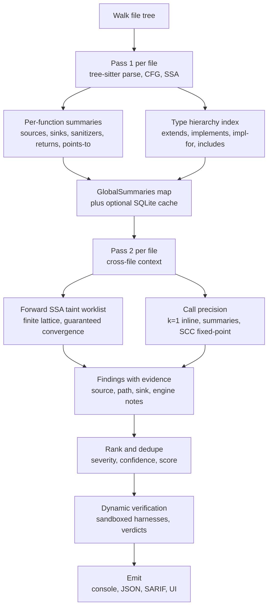

# How Nyx works

If you're going to act on a finding, it helps to know how the scanner got there. This page is the short version. Source paths are linked where the answer to "exactly what does it do" lives in the code.

## The pipeline

A scan runs in two passes over the file tree, with an optional SQLite index that lets the second scan skip files whose content hash hasn't changed.

**Pass 1, per file.** Tree-sitter parses the file. Nyx builds an intra-procedural control-flow graph, lowers it to SSA, and extracts a summary per function describing what that function does at the boundary: which arguments flow to sinks, which sources it reads from, which sinks it calls, what taint it strips, what it returns. Summaries are persisted to SQLite ([`src/summary/`](https://github.com/elicpeter/nyx/tree/master/src/summary/), [`src/database.rs`](https://github.com/elicpeter/nyx/blob/master/src/database.rs)).

**Summary merge.** All per-file summaries get unioned into a global map keyed by qualified function name.

**Pass 2, per file.** Each file is reanalysed with the global summaries available. The taint engine runs a forward dataflow worklist over the SSA representation. When it hits a call, it consults summaries to decide whether the call propagates taint, sanitizes it, or terminates the flow. Findings are produced when tainted data reaches a sink whose required capability is still set on the value.

Two extra layers tune precision around calls. **Context-sensitive inlining** (k=1) re-runs intra-file callees with the actual argument taint at the call site, so a helper called once with tainted input and once with sanitized input produces the right result for each call. **SCC fixed-point**: when a group of mutually-recursive functions forms a strongly-connected component in the call graph, the engine iterates summaries to a joint fixed-point (capped at 64 iterations). SCCs that span files are also handled.

When a method call has a receiver typed as a super-class, trait, or interface, **hierarchy fan-out** widens the resolved callee set to every concrete implementer the engine has seen. A class diagram extracted in pass 1 (Java extends/implements, Rust impl-for, TS/JS extends, Python bases, Ruby includes, PHP extends/implements, C++ inheritance) feeds an index that the call resolver consults during pass 2. The fan-out is capped at 8 implementers per call site; over-fanning is a precision tax, not a soundness issue.

A separate **field-sensitive points-to** pass tracks abstract locations down to the field level, so `c.mu.Lock()` is a lock on `Field(c, mu)` rather than on `c` as a whole. That distinction is what lets the resource-lifecycle and taint passes tell `obj.field = tainted; sink(obj.other_field)` apart from the conservative whole-variable approximation. Subscript reads and writes (`arr[i]`, `map[k] = v`) lower to synthetic `__index_get__` / `__index_set__` calls so the same container model handles them. Set `NYX_POINTER_ANALYSIS=0` to fall back to the pre-pointer-pass behaviour for baseline comparison.

**Dynamic verification.** After ranking and dedupe, default builds verify Medium and High confidence findings unless `--no-verify` or `scanner.verify = false` is set. The verifier derives a small harness from the finding, runs it in a sandbox against curated payloads, and stores the result on `evidence.dynamic_verdict`. `Confirmed` means a vulnerable payload fired and its benign control stayed clean. `NotConfirmed` means the harness ran but did not fire, not that the finding is closed.

## Optional analyses on top

These run on top of the forward taint pass. They're independently switchable via `[analysis.engine]` config or matching CLI flags. See [advanced-analysis.md](advanced-analysis.md) for the full description and tradeoffs.

| Pass | Purpose | Default |
|---|---|---|
| Abstract interpretation | Carries interval and string prefix/suffix bounds alongside taint. Suppresses findings on proven-bounded integers and locked-prefix URLs | on |
| Context sensitivity | k=1 inlining for intra-file callees | on |
| Field-sensitive points-to | Distinguishes `obj.field` from `obj` itself, so a tainted write to one field does not poison reads from another. Also gives the resource-lifecycle pass per-field locks | on |
| Hierarchy fan-out | When a method call's receiver is typed as a super-class, trait, or interface, widens callee resolution to every concrete implementer the engine has seen | on |
| Constraint solving | Drops paths whose accumulated branch predicates are unsatisfiable. Optional Z3 backend with `--features smt` | on |
| Symbolic execution | Builds an expression tree per tainted value. Produces a witness string at the sink. Detects sanitization patterns the taint engine alone would miss | on |
| Backwards analysis | After the forward pass, walks backwards from each sink to confirm or invalidate the flow. Annotates findings as `backwards-confirmed`, `backwards-infeasible`, or `backwards-budget-exhausted` | off |

`--engine-profile fast | balanced | deep` flips groups of these at once. `balanced` is the default and the configuration the benchmark numbers in [language-maturity.md](language-maturity.md) are measured against.

## Where bounds live

Static analysis at scale means choosing where to stop. Nyx exposes its bounds rather than hiding them:

- **Inline depth** is k=1. Callees larger than the inline body-size cap fall back to summary-based resolution.
- **SCC fixed-point** is capped at 64 iterations. If a recursive cluster doesn't converge, the engine emits the best summary it has and records an `engine_note` on affected findings.
- **Lattice width** is bounded. Taint origin sets cap at 32 entries per SSA value (`--max-origins`); points-to sets cap at 32 heap objects (`--max-pointsto`). Truncation is recorded as `OriginsTruncated` / `PointsToTruncated` so you can see when precision was lost.
- **Symbolic expressions** cap at depth 32. Deeper expressions degrade to `Unknown` rather than growing without bound.

Findings whose engine notes indicate a bound was hit can be filtered with `--require-converged` for strict CI gates. The flag drops over-reports and bails; under-reports (where the emitted finding is still real but the result set is a lower bound) are kept.

## What you get out

Each finding carries the source location, the sink location, the path in between (when symex produced one), the rule ID, severity, attack-surface score, confidence level, dynamic verdict when one was attempted, and a list of engine notes describing any precision loss along the way. Console output is human-readable; JSON and SARIF carry the full evidence object for tooling.

For the JSON shape and SARIF mapping, see [output.md](output.md).
